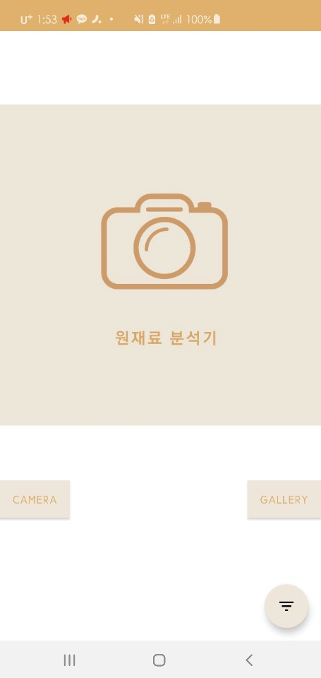
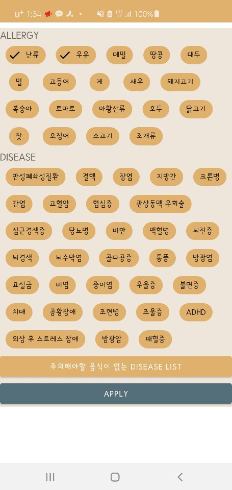

## 2020-2-OSSP1-OCRILA-4
* [General](#General-info)
* [Technologies](#Technologies)
* [Preview](#Preview)

## General info
OCR 라이브러리를 이용한 가공식품 원재료명 분석 어플
	
## Technologies
Project is created with:
* Android Studio version: 4.1
* tesseract version: 0.1.3
* Android-Image-Cropper	

## GRADLE SETTINGS
implementation 'androidx.appcompat:appcompat:1.2.0'
    implementation 'com.google.android.material:material:1.2.1'
    implementation 'androidx.constraintlayout:constraintlayout:2.0.4'
    implementation 'androidx.navigation:navigation-fragment:2.3.1'
    implementation 'androidx.navigation:navigation-ui:2.3.1'
    testImplementation 'junit:junit:4.+'
    androidTestImplementation 'androidx.test.ext:junit:1.1.2'
    androidTestImplementation 'androidx.test.espresso:espresso-core:3.3.0'

    implementation fileTree(dir: 'libs', include: ['*.jar'])
    androidTestImplementation 'com.android.support.test:runner:1.0.2'
    androidTestImplementation 'com.android.support.test.espresso:espresso-core:3.0.2'

    api 'com.github.yalantis:ucrop:2.2.2'
    implementation 'com.theartofdev.edmodo:android-image-cropper:2.4.+'

    implementation 'androidx.coordinatorlayout:coordinatorlayout:1.1.0'
    implementation 'com.google.android.material:material:1.2.1'
    implementation 'androidx.appcompat:appcompat:1.2.0'
    implementation 'androidx.constraintlayout:constraintlayout:2.0.4'
    testCompile 'junit:junit:4.12'
    compile 'com.android.support:appcompat-v7:27.0.2'
    compile 'com.android.support:design:27.0.2'
    compile 'com.google.api-client:google-api-client-android:1.23.0' exclude module: 'httpclient'
    compile 'com.google.http-client:google-http-client-gson:1.23.0' exclude module: 'httpclient'
    compile 'com.google.apis:google-api-services-vision:v1-rev369-1.23.0'
    api 'com.github.yalantis:ucrop:2.2.2'
    
## Preview

